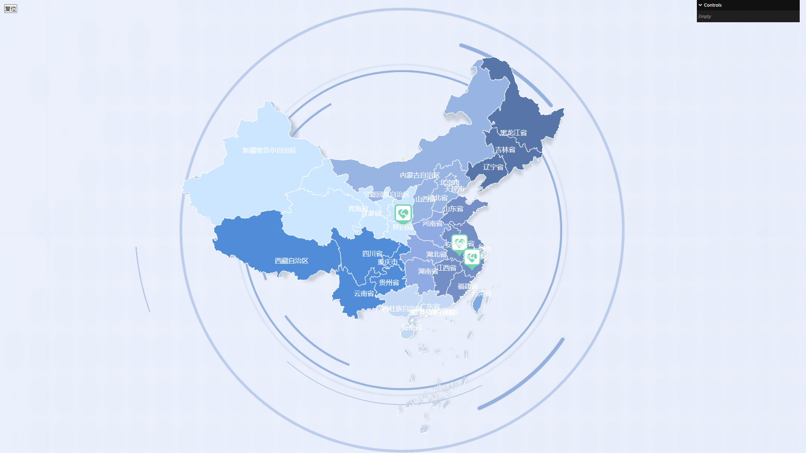

# Three.js + GIS Map

使用 three.js 加载 GeoJSON 文件，绘制地图并展示。并使用 gsap 实现动效。

## Image

## Features

1. 加载 GEOJSON 文件，绘制地图、边界线、注记，并为各个大区设置不同的颜色
2. 通过光照绘制阴影效果，通过 OrbitControls 控制视角，并限制地图的拖动范围
3. 设置平面贴图及旋转动画
4. 添加点位(sprite)，实现弹跳效果，并设置点击事件，点击可弹窗
5. 重置复位功能
